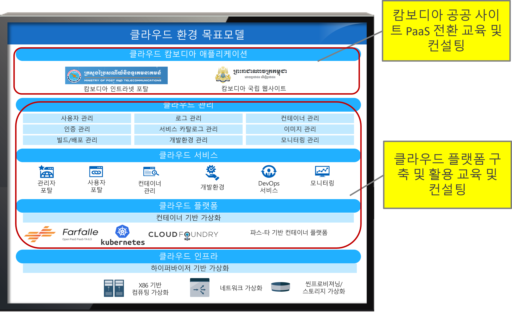
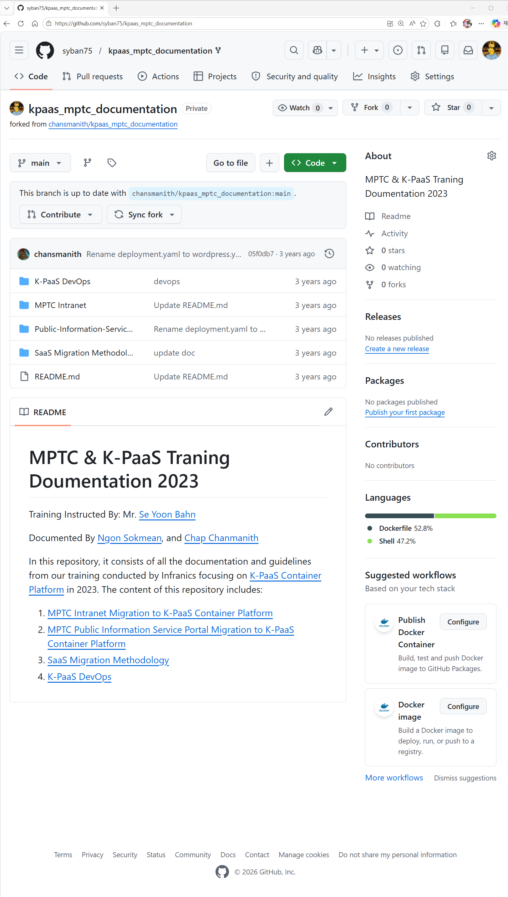

### 🤝 한-캄보디아 디지털정부 협력센터 공동협력과제

* 클라우드 기반 인프라 아키텍처 설계 지원 
* Kubernetes 플랫폼 구성 및 활용 방안 제시 

* 애플리케이션의 클라우드 전환 전략 수립 
* 현지 인력 대상 실습 중심 기술 교육 진행 
* 운영 및 관리 체계 수립 컨설팅
  
[캄보디아 현지인력 교육 내용](https://github.com/syban75/kpaas_mptc_documentation.git)

